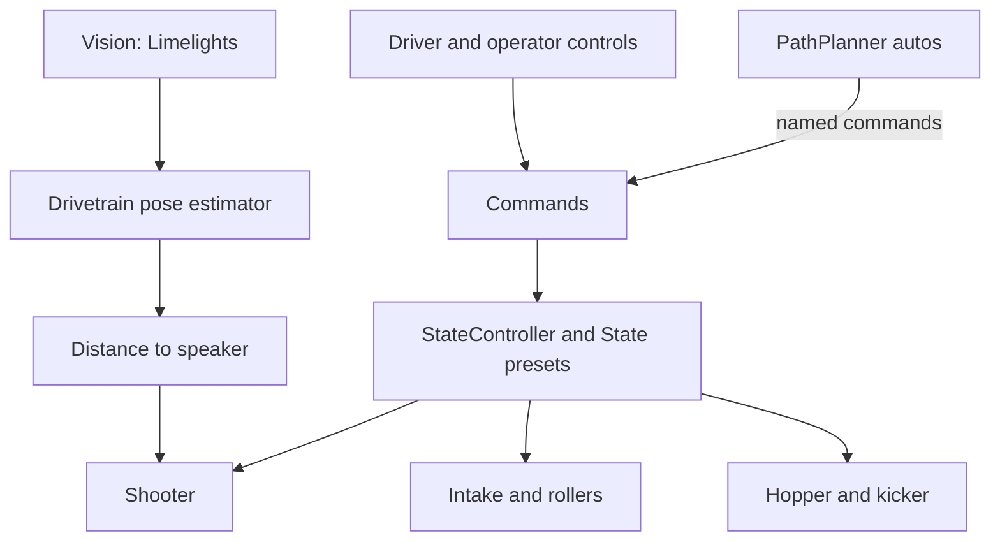

# C2024: 2024 Competition Robot Code, Offseason Rewrite (FRC 2024 Crescendo)

Java robot code for Team 498's 2024 CRESCENDO robot. The main-season code was written by previous team programmers. Over the offseason, the programming team found that the robot had no reliably working swerve code, a messy subsystem structure, and weak vision, and rewrote large parts of it. I led that work as programming lead. This repo is the result.

Stack: Java 17 · WPILib 2024 (command-based) · CTRE Phoenix 6 · PathPlanner · PhotonVision · Limelight

---

## Highlights

- Swerve drivetrain: a CTRE Tuner X-generated Phoenix 6 swerve (`CommandSwerveDrivetrain`, `TunerConstants`) integrated with PathPlanner's holonomic autonomous builder, replacing the team's earlier custom swerve code.
- Vision: for most of the offseason, two PhotonVision cameras on the sides of the robot used multi-tag PnP on the coprocessor (with a lowest-ambiguity fallback) to feed the drivetrain pose estimator while the robot was stationary in teleop. Those two cameras were later swapped for Limelights.
- Limelight localization: a two-camera MegaTag 2 pose-fusion class (`LimelightLocalization`) for the left and right Limelights, with rejection logic (no tags seen, pose outside the field, robot moving). This was tested right before the 2025 season. The PhotonVision code is still in the repo.
- Speaker alignment: `CrescendoAlign`, written by me, uses the center Limelight to turn the robot toward the speaker AprilTag, using `tx` with latency compensation from gyro heading history.
- Shooter control: dual flywheels with PID plus feedforward velocity control, a CANcoder-based angle mechanism with PID and arm feedforward, and a separate feed motor. Shooter angle and speed are chosen from distance to the speaker using interpolated lookup tables (`ShooterUtil`).
- Modeling notebooks: exploratory Python notebooks (`notebook/`) for early shooter curve-fitting and Limelight geometry experiments.
- Robot states: a `State` enum with 21 presets (intake, source, amp, subwoofer, podium, crescendo, and others), each defining setpoints for the shooter, hopper, intake, intake rollers, and kicker. `StateController` tracks the current state and the next scoring and loading options.
- Command library: more than 50 small command classes for loading, scoring, shooter, hopper, intake, kicker, and drivetrain actions, used by both teleop controls and autonomous.
- Autonomous: PathPlanner paths and about ten autos built from 20+ registered named commands.
- Note handling: beam breaks in the hopper stop a note in the right spot during ground intake (`StoreNote`), rumble the driver and operator controllers, and drive the LED status colors (intake success and note secured). A beam break in the kicker feeds a "Note Ready To AMP" dashboard indicator.

---

## Architecture

Driver and operator inputs (`Controls`) trigger commands, which set the robot `State` through `StateController`. Each subsystem applies the setpoints defined for its part of that state. PathPlanner autos call the same commands through named commands, so teleop and autonomous share one set of robot actions. Vision updates the drivetrain pose estimator, and the shooter reads distance to the speaker to pick its angle and speed.



### Repository layout

```
src/main/java/org/team498/
├── C2024/
│   ├── Robot.java, Controls.java      # Robot lifecycle, named commands, driver/operator bindings
│   ├── State.java, StateController.java  # Robot state presets and scoring/loading options
│   ├── ShooterUtil.java               # Distance -> shooter angle/speed interpolation
│   ├── RobotPosition.java, FieldPositions.java  # Field geometry and distance helpers
│   ├── Constants.java, Ports.java     # Tuning constants and CAN IDs
│   ├── subsystems/                    # Drivetrain, shooter, intake, hopper, kicker, vision, LED
│   └── commands/                      # Loading, scoring, shooter, intake, drivetrain commands
├── lib/                               # Team utilities: drivers, field geometry, interpolation
└── notebook/                          # Python modeling notebooks
src/main/deploy/pathplanner/           # Paths and autos
```

---

## Project status & honest scope

The 2024 season code was written by previous programmers. I joined programming in the summer of 2024 with minimal experience, learned through Codecademy and team sessions while our shop was closed, and became programming lead about two months later. This offseason rewrite was my first major project in that role, and I worked on it with other programmers on the team, not alone.

- What I worked on: the CTRE Tuner X swerve integration, `CrescendoAlign`, and a couple of the autonomous routines, along with other programmers on the team.
- Vision hardware changed during the offseason: two PhotonVision cameras on the sides were later replaced by Limelights, with a third Limelight in the middle for speaker alignment.
- Some older or experimental files are kept as `.txt` and are not compiled. `SwerveModule.java` is a leftover from the earlier custom swerve and is no longer used.
- Tuning values such as shooter angles and speeds are hand-tuned presets plus the interpolation table in `ShooterUtil`.

### Known issues / what I'd do next

- Clean up the repo: remove commented-out code, the unused `SwerveModule.java`, stale comments, and duplicate "Copy of" autos and paths. We ran out of time to do this before the 2025 season.
- Add unit tests for the shooter interpolation and state logic, and move setpoints out of the `State` enum into per-subsystem constants.

---

## Build & run

Requires the [WPILib 2024](https://docs.wpilib.org/) toolchain (JDK 17).

```bash
./gradlew build          # compile
./gradlew simulateJava   # run in WPILib simulation
./gradlew deploy         # deploy to a roboRIO
```

---

## Credits

- Swerve constants generated with CTRE Tuner X; `LimelightHelpers.java` is the standard Limelight library.
- Uses [PathPlannerLib](https://pathplanner.dev/), [PhotonVision](https://photonvision.org/), and CTRE Phoenix 6.

## About

Built by Stephenjoy Tamasi, Computer Systems Engineering student at Arizona State University, as programming lead of 498 Robotics. Interested in robotics, embedded systems, and controls software.
